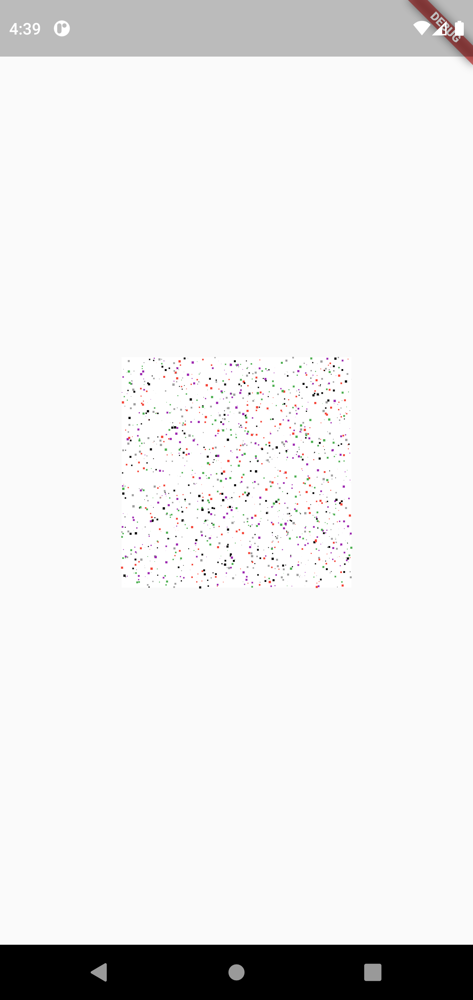
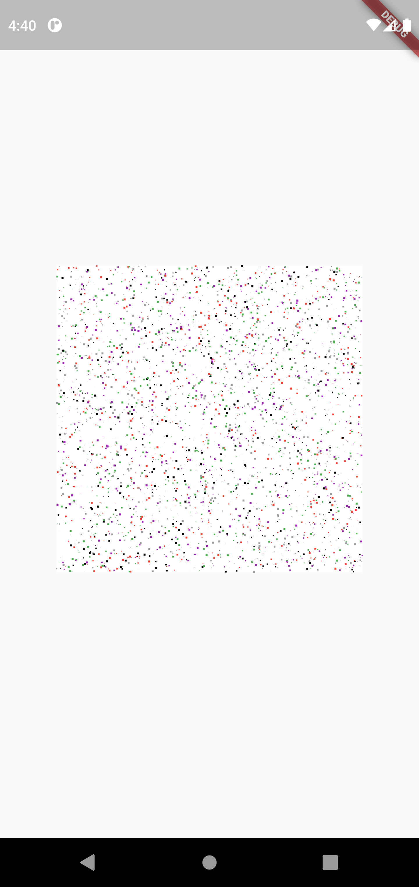

# noise_generation

A Flutter package that allows to generate random noise patterns.

## Screenshots

  

## How to Use

First you have to set the dependencies,
```dart
noise_generation
```
Then you have to import the package in your project,
```dart
import 'package:noise_generation/noise_generation.dart';
```
Created by [Harsh Chhikara](https://www.linkedin.com/in/harsh-chhikara-191a84175/)